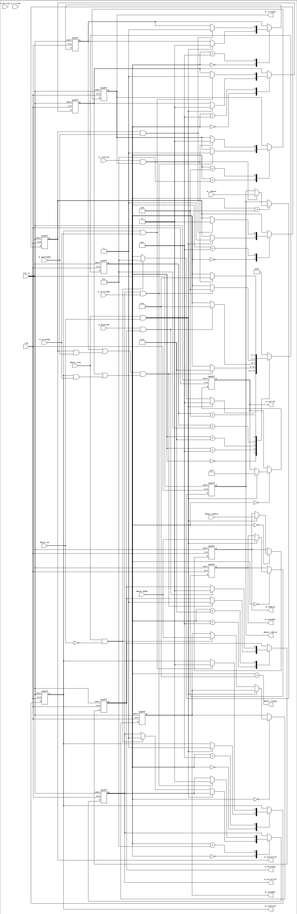
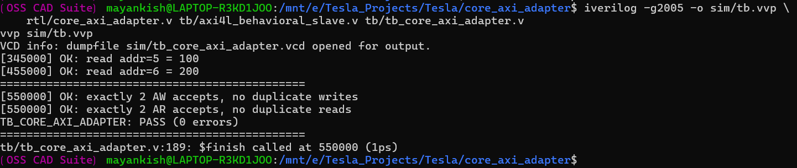
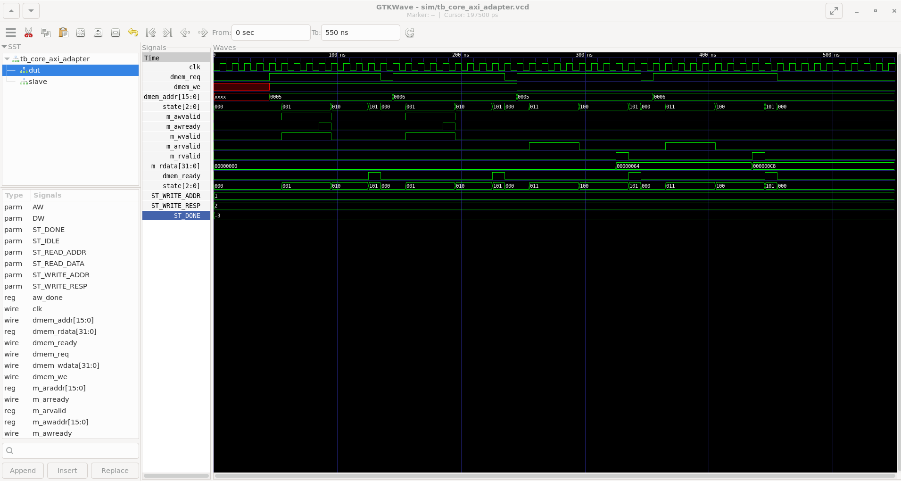
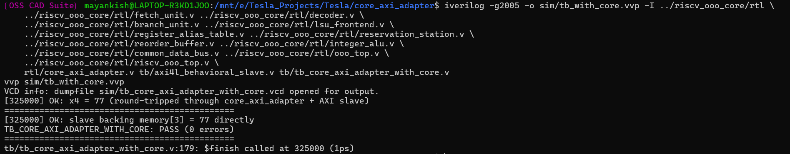

# AXi-Adapter

A single-outstanding-transaction AXI4-Lite master that converts a simple
request/ready handshake — one address, one write-enable bit, read and
write data — into real AXI4-Lite bus transactions. It exists so a CPU
core with a plain memory-style interface can issue loads and stores that
actually reach a shared bus, without the core itself having to speak AXI.

## Tech stack

| Layer | Tool |
|---|---|
| HDL | Verilog (IEEE 1364-2005) |
| Simulation | Icarus Verilog (`iverilog` / `vvp`) |
| Waveform viewing | GTKWave |
| Synthesis / netlist extraction | Yosys (`write_json`) |
| Circuit diagrams | [netlistsvg](https://github.com/nturley/netlistsvg) |

## Background

AXI (the Advanced eXtensible Interface) is the on-chip bus protocol
defined in ARM's AMBA specification family [1] and is, in practice, the
default choice for connecting processor cores, DMA engines, and
peripherals inside a modern SoC — it separates address and data into
independent channels, allows multiple transactions to be outstanding at
once on the full protocol, and gives every agent on the bus a common,
well-defined handshake (`VALID`/`READY` on every channel) instead of
each block inventing its own. AXI4-Lite is the reduced, register-access
subset of that protocol: no bursts, one beat per transaction, aimed at
exactly the kind of simple load/store and control/status traffic a small
core or peripheral generates, at a fraction of the interface complexity
of full AXI4. The broader motivation — standardizing point-to-point bus
interfaces so blocks can be connected through a shared fabric instead of
custom point-to-point wiring — is the same one that motivated on-chip
interconnect research more generally as SoCs grew from a handful of
blocks to dozens [2].

A CPU core's own memory interface, though, is almost never AXI-shaped
natively — it is usually something much simpler internally (an address,
a byte-enable, and a same-cycle or short-latency response), because
that is what is easy to reason about inside a pipeline. The adapter in
this repository is the piece that sits between those two worlds: a
simple request/ready interface on one side, a real, protocol-correct
AXI4-Lite master on the other.

## Architecture

Circuit diagram generated directly from the RTL (Yosys `write_json` +
[netlistsvg](https://github.com/nturley/netlistsvg)):



The adapter is a single finite-state machine (`IDLE -> AW/W -> B` for a
write, `IDLE -> AR -> R` for a read) that: latches the incoming request's
address/write-data/write-enable; drives the appropriate AXI channels;
and reports completion back on `dmem_ready`. `AWVALID` and `WVALID` are
asserted together and accepted independently — whichever of
`AWREADY`/`WREADY` arrives first is latched and held until the other
arrives, a standard pattern for a simple AXI4-Lite master that does not
want to require a slave to accept both channels simultaneously. Only one
transaction is outstanding at a time, matching the execution model of
the core this adapter was built for (see `riscv_ooo_core`), which never
issues a second memory request before the first completes.

## A same-cycle-completion race, found and fixed

The first version of this adapter made its `dmem_ready` output a
**registered** one-cycle pulse, asserted the cycle after the state
machine returned to `IDLE`. That one-cycle lag matters because a
requester's own "is my request still pending" register typically drops
its request signal the cycle *after* it observes `ready` — so for one
cycle, the adapter was already back in `IDLE` while the requester's
`req` line was still asserted (correctly, from the requester's point of
view) for the transaction that had *just* completed. `IDLE` cannot tell
"leftover request from the transaction I just finished" apart from "a
genuinely new request," and started a second, spurious transaction using
stale address and data.

This was caught by a testbench that modeled the requester's request
signal as an actual clocked register with the same timing a real
requester would use, driving back-to-back write/write/read/read
transactions with zero idle cycles between them — three address-channel
accepts were observed for two real writes, and the reads that followed
came back shifted. An earlier, less careful version of the same
testbench (which cleared its request signal on a negative clock edge
rather than modeling a real posedge-clocked register) missed the bug
entirely, because it happened to drop the request slightly earlier than
a real register would, sidestepping the exact race window by accident —
a reminder that a testbench which doesn't model the requester's actual
register timing can pass for the wrong reason.

Fixed by making `dmem_ready` **combinational** — a Mealy output tied
directly to the state machine being in its "done" state — instead of a
registered pulse. This removes the lag entirely: the adapter's return to
`IDLE` and the requester's own request-clearing logic now observe
completion on the exact same cycle, so there is no window in which a
stale request can be mistaken for a new one.

## Verified

- `tb/tb_core_axi_adapter.v` — the adapter alone, against a deliberately
  multi-cycle (not same-cycle) behavioral AXI4-Lite slave, running
  back-to-back write/write/read/read with zero idle cycles and
  independently counting address-channel accepts on the slave side.
- `tb/tb_core_axi_adapter_with_core.v` — an integration test using a real
  out-of-order core (not a synthetic driver): a short program stores a
  value through the adapter, loads it back, and halts, with both the
  committed register value and the slave's backing memory checked
  directly.

```bash
iverilog -g2005 -o sim/tb.vvp \
    rtl/core_axi_adapter.v tb/axi4l_behavioral_slave.v tb/tb_core_axi_adapter.v
vvp sim/tb.vvp
# TB_CORE_AXI_ADAPTER: PASS (0 errors)
```

### Proof of execution

Terminal output from the adapter-alone run above, and the corresponding
GTKWave capture (`m_awvalid`/`m_arvalid`/`dmem_ready` and the `state`
FSM advancing through a read and a write):





Full-resolution waveform: [`docs/images/GTKwave_output_waveform.pdf`](docs/images/GTKwave_output_waveform.pdf).

The integration test (`tb/tb_core_axi_adapter_with_core.v`, a real
out-of-order core issuing the store/load) passing, from the same
terminal session:



Circuit diagram regeneration command: `docs/NETLIST_DIAGRAMS.md`.

## What's out of scope

No burst support — AXI4-Lite has none by definition, this is
intentional, not a limitation. No error-response handling — `BRESP`/
`RRESP` are not consumed, since the requester side this adapter was built
for has no error-reporting path of its own yet. Single outstanding
transaction only, matching the requester's own execution model — no
request pipelining or multiple in-flight transactions.

## References

1. ARM Limited, *AMBA AXI and ACE Protocol Specification*, ARM IHI 0022.
2. L. Benini and G. De Micheli, "Networks on Chips: A New SoC Paradigm,"
   *IEEE Computer*, vol. 35, no. 1, pp. 70–78, 2002.
